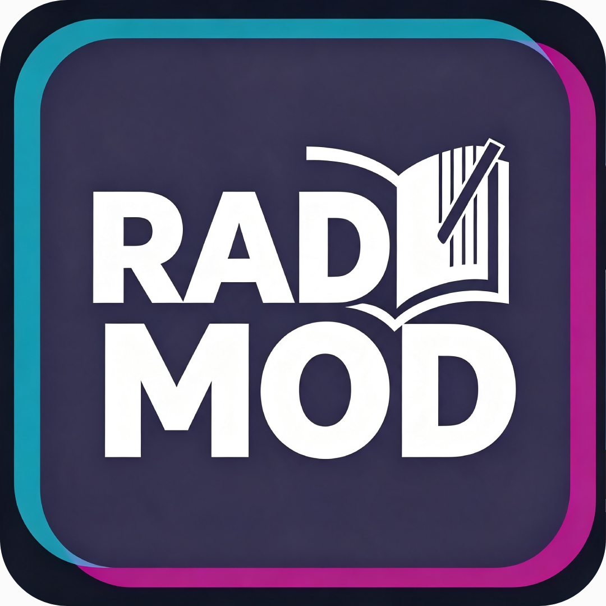

<div align="center">
  <a href="https://github.com/coonlink">
    
  </a>
  <h1>Chill with You : Lo-Fi Story — Мод «Радио»</h1>

[](README.md)
[](README.ru.md)


</div>

<br />

<div align="center">
  <p>Добавляет в игру <b>рабочее интернет-радио</b>. Переключение станций — без заикания.</p>
</div>

## Требования

Чтобы радио заработало, нужно **всё** из списка:

1. Игра **Chill with You : Lo-Fi Story** (любая версия, Steam), запущенная один раз.
2. **BepInEx 5.x**, установленный в папку игры
   → `...Chill with You Lo-Fi Story/BepInEx/`
   (установщик ставит его автоматически, если его нет — например, после переустановки игры).
3. Файлы плагина `RadioStreamPlugin.dll` и `NLayer.dll` (этот мод).
4. Интернет (радио играет вживую из сети).


## Как установить (игроку, сборка не нужна)

**Вариант A — установщик в один клик (рекомендую)**

Положите `install.sh`, `install.bat`, `RadioStreamPlugin.dll`, `NLayer.dll` и `radiostations.txt` в одну папку и запустите установщик для своей ОС:

- **Windows:** двойной клик по `install.bat`
- **Linux / Steam Deck:** `./install.sh`

Установщик найдёт игру в **любой Steam-библиотеке** (включая нестандартные пути и внешние диски), сам поставит BepInEx, если его нет (например, после того как игру удалили и скачали заново), и скопирует мод в `BepInEx/plugins`. Если игра не нашлась — спросит путь вручную.

**Вариант B — вручную**

1. Установите игру через Steam и **один раз** запустите её, чтобы создались папки.
2. Положите **BepInEx 5.x** в папку игры:
   - Windows: `Chill with You Lo-Fi Story/BepInEx/`
   - Steam Deck / Linux (flatpak):
     `~/.var/app/com.valvesoftware.Steam/.local/share/Steam/steamapps/common/Chill with You Lo-Fi Story/BepInEx/`
3. Скопируйте **все файлы** из этого репозитория в папку **plugins**:
   ```
   BepInEx/plugins/RadioStreamPlugin.dll     ← сам мод
   BepInEx/plugins/NLayer.dll                ← декодер MP3 (обязателен)
   BepInEx/plugins/radiostations.txt         ← список станций
   ```
4. Запустите игру, откройте меню музыки и переключайте станции клавишами **J / K**.

Если файла со станциями нет — плагин использует стандартные. Если после переустановки игры пропал BepInEx — запустите `install.sh` / `install.bat`, он поставит его автоматически.


## Как настроить станции

`radiostations.txt` — по одной станции на строку, формат (сначала URL, через `|`):

```
URL|Название|Автор|Описание
```

Пример:

```
http://example.com/lofi.mp3|Lo-Fi Beats
http://example.com/jazz.pls|Jazz Radio
```

Измените файл и **перезапустите игру** — новые станции подхватятся. Радио играет только если адрес станции доступен (для некоторых `.pls`/`.m3u` нужен браузер — лучше вставлять прямые ссылки на `.mp3`/`.aac`).


## Управление

| Клавиша | Действие |
|---|---|
| **J** | Предыдущая станция |
| **K** | Следующая станция |


## Если не работает

- **Нет радио в меню / нет музыки** → проверьте, что BepInEx реально установлен (в папке игры должна быть `BepInEx/core`), а в `BepInEx/plugins` лежат `RadioStreamPlugin.dll` **и** `NLayer.dll`. Если игру только что переустановили — запустите установщик заново, он восстановит BepInEx и мод.
- **Станция не играет** → адрес недоступен или формат не поддерживается. Замените её в `radiostations.txt` на прямую ссылку потока.
- **Не видно консоли BepInEx** → в `BepInEx/config/BepInEx.cfg` включите `[Logging.Console] Enabled = true`.

## Сборка из исходников (для разработчиков)

Нужен .NET SDK (>= 6) и скрипт `build.sh` (сам находит игру на Linux / Windows, собирает и копирует DLL). Запуск:

```bash
./build.sh
```
